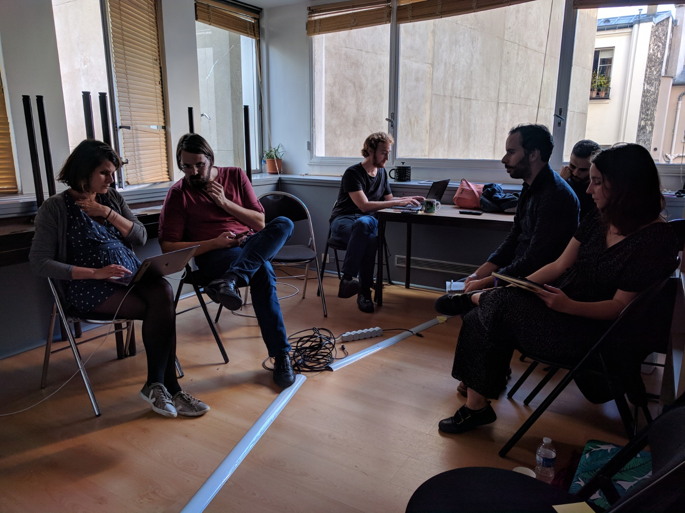
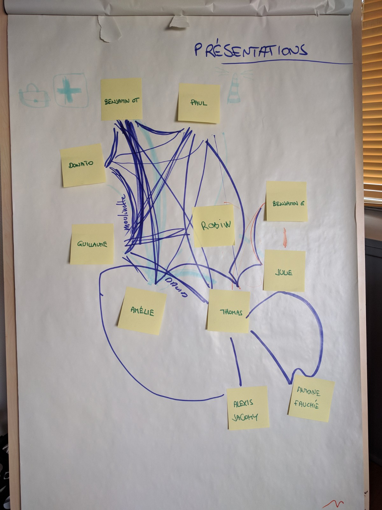
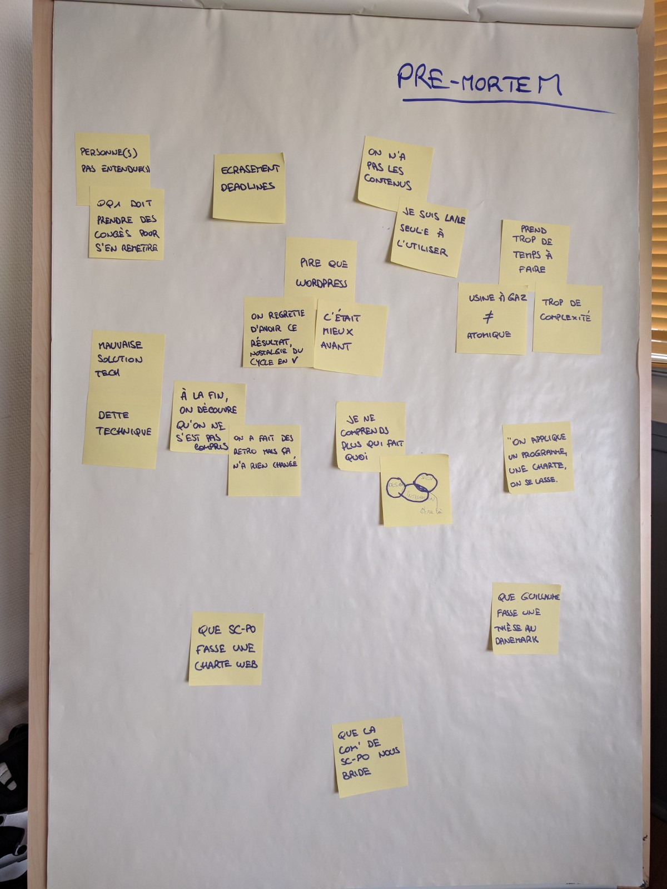
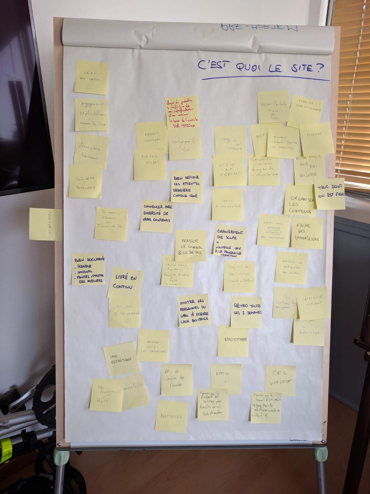
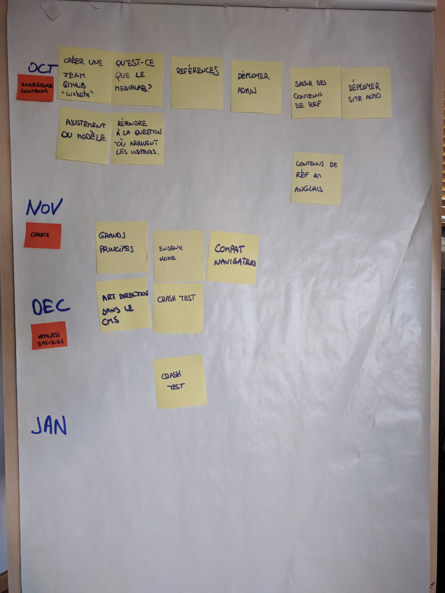

# Déroulé de la journée

1. météo interne
1. présentations (en réseau)
1. objectifs et attentes
1. pre-mortem
1. c'est quoi le site du Médialab ?
1. déjeuner
1. c'est quoi le site du Médialab ?
1. questions et mystères
1. chronologie projet
1. prises de rendez-vous
1. tour de parole, pour conclure

# Présentations

> Nous nous présentons tour à tour en dessinant et racontant les liens qui nous relient aux autres personnes du groupe.

De nouveaux noms apparaissent : Robin de Mourat, David Bruant, Alexis Jacomy et Antoine Fauchié.

# Pré-mortem

> Imaginons : nous sommes le dernier jour du projet, il s'est terminé dans de mauvaises conditions. Pourquoi le projet a échoué ? Qu'est-ce qui serait de plus terrible pour toi ?

- Personne(s) pas entendue(s)
- Quelqu'un·e doit prendre des congés pour s'en remettre
- Écrasement par les _deadlines_
- Le résultat est pire que WordPress
- « C'était mieux avant »
- On regrette ce résultat, nostalgie du cycle en V
- Mauvaise solution tech
- Dette technique
- À la fin on découvre qu'on ne s'est pas compris
- On a fait des rétrospectives mais ça n'a rien changé
- Que Sciences-Po fasse une charte web entre temps
- Que la com' de Sciences-Po nous bride
- Que Guillaume parte faire une thèse au Danemark
- Je ne comprends plus qui fait quoi
- Devoir faire une partie du travail de développement qui était assimilée à de l'intégration front-end
- « On applique un programme, une chare, on se lasse. »
- Ça prend trop de temps à faire
- Usine à gaz, pas assez atomique
- Trop de complexité
- On n'a pas les contenus
- Je suis le/la seul·e à l'utiliser

# C'est quoi le site du Médialab ?

> Chacun·e évoque tour à tour ce que représente le site du Médialab, et éventuellement son implication dans le projet.

- Décroissance heureuse
- Cohérence
- Se nourrir / Nourrir du travail du dev'
- Essayer de garantir la construction d'une infrastructure et ...
- Usage en com' interne
- Utile aux membres
- Ouvrir la boîte noire du labo
- Rendre visible « toutes » les activités
- Comprendre au mieux les enjeux liés à chaque contenu
- Refléter l'interdisciplinaire
- Moderne
- Ne pas passer pour des bolosses
- Un truc dont on est fièr·e
- Organiser les contenus
- Faire des (hyper)liens
- Avoir une _approche globale_ des contenus
- Pousser la réflexion du détail
- Catalogue
- Contenus hyper navigation
- « Ceci n'est pas un datascope »
- Static website
- M'assurer que le travail d'intégration se fait dans les meilleures conditions
- Admin / UI
- M'assurer que l'UI d'admin est _tailored_ pour Amélie et Alii
- API et Gestion des Données
- Adaptatif
- Pas fouilli / épuré
- Une esthétique
- Design utile (vs graphique)
- Minimaliste
- Livré en continu
- … oui mais pas 50 branches
- Bien documenté — `README.md`, `JOURNAL.md`, minutes et photos des ateliers
- Penser le global et le détail
- ??
- Changement de scope = nouvelle issue à la prochaine itération
- Commencer avec une diversité de vrais contenus
- Bien définir les attentes derrière chaque _issue_
- Outil à alimenter
- Rétrospectives toutes les 2 semaines
- Prototyper
- Projet commun
- Public divers
- Embarquer le labo

## Implications

- Faire des choix
- Engagement : explicitation, assumer les choix
- Suivre / intervenir

# Questions et mystères

> Quelles questions occupent encore notre esprit et quels éléments n'ont pas été abordés dans les précédents ateliers ?

## Contenus (modèles)

- Section « Outils » (aujourd'hui sur un site séparé) ?
- Gestion des événements (type non uniforme)
- Gestion des contenus Actualités
- Quelles catégories de contenu ? Modèle de données

## Contenus (écrits)

- Est-ce qu'on peut produire un contenu sans le CMS ?
- Que faire du contenu existant ?
- Quand est-ce que le contenu sera mis à disposition ? Quand est-ce qu'on fait ça ?
- Préparation des « contenus »
- Multilingue ?
- Quand aurons-nous un aperçu des contenus ?
- Créer les premières pages ?

## UI

- Deux versions du site _safe_ / _advanced_ ?
- Comment gérer l'internationalisation ?
- Trous dans les langues (contenus non-traduits)

## Identité

- C'est quoi le Médialab ?
- Que pensez-vous de notre conception ?
- Interdisciplinarité ?
- Dataviz ? Qu'est-ce qui rend le Médialab singulier, à voir sur le site ?
- Quelle ambition on se donne par rapport à Sciences-Po ? (démarcation)

## Contribution

- Pourquoi on alimenterait le site ? Motivation ?
- Trouverons-nous le temps d'écrire ?
- _Versioning_ + _revert_ ?
- Embarquer le labo vs. « Fonctionnel mais moche » — fonctionnel pour qui ? Défini par qui ?
- Quel niveau de liberté graphique pour l'édition des contenus ?

## Objet

- Vitrine ? Catalogue ? ~~Datascape~~
- Quel niveau de détails ? Quand ?
- ?? ou succint — Quand décide-t-on ?
- Décroissance heureuse vs. Fichiers JSON + CMS Custom

## Workflow

- Organisation des fichiers (pour les prototypes) ?
- Quel/Quand temps de travail commun avec les devs ?
- Préprod / Admin
- Formation des rendus design
- Besoins côté design
- Qu'est-ce que je priorise ?
- Comment on travaille ?
- Où on parle ?
- Comment on travaille ?
- Création : comment partage-t-on les doutes ?
- Temporalité de travail (attentes)
- Comment allons-nous travailler ensemble ?
- Planning
- Quel rythme de travail / Prochain atelier physique ou virtuel ?

# Compréhension du déroulement du projet

---

# Points de vigilance

- Tension entre les ambitions / temps disponible
- Attentes élevées sur les contenus
- Sur-ingéniérie vs. besoins et compréhension des contributrices et contributeurs
- Oublier les publics qui vont lire les contenus du site
