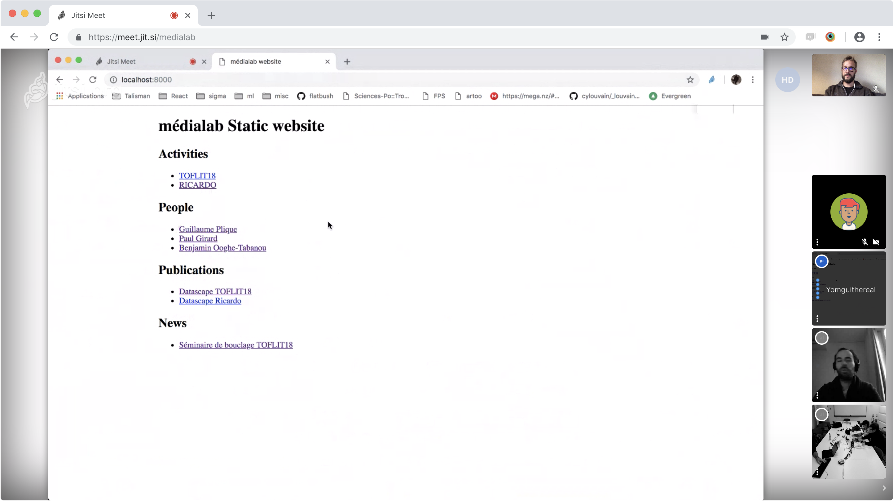
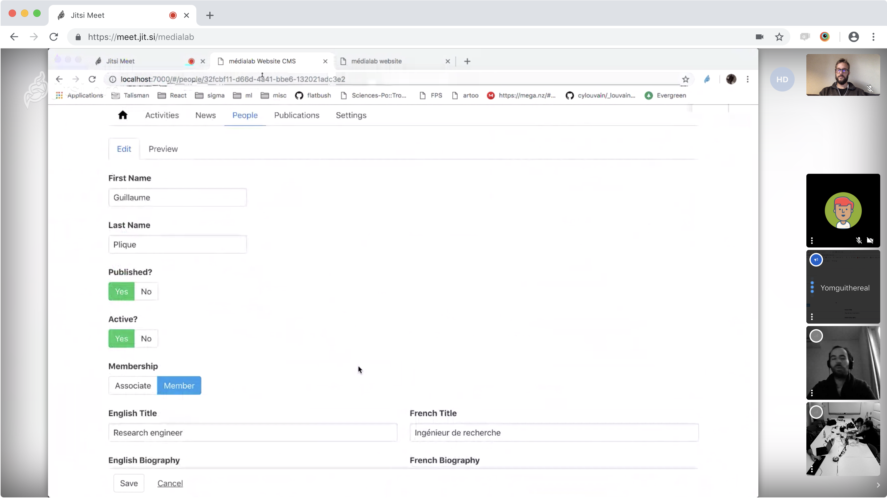

# Rétrospective medialab.sciences-po.fr

Le projet a démarré il y a 1 mois et demi. Quand j'ai questionné 

(présentation de l'agenda)

Est-ce qu'il y a des questions avant qu'on passe à la première étape ?

# Agenda

1. météo 
2. démos
3. suivi des actions
4. joies
5. freins
6. le temps des mystères
7. annonces et rendez-vous

# Démos

> Je prends le temps de montrer aux autres ce sur quoi j'ai travaillé cette semaine.

- le CMS (Guillaume) • refonte des formulaires avec leur schéma, front « nu »
- les pitchs projet (Amélie) • https://docs.google.com/document/d/17PrKSFKewsm2OqEM_oMHxPvU7okuq5G2mW8zt8EeHsE/edit?ts=5bec2338#heading=h.hen36rvjdllk
- les images (Amélie + Donato) • Amélie prépare un dossier et on verra en dehors

# Suivi des actions

(ce sont des points notés lors de la précédente rétrospective)

> hier j'ai essayé d'écrire ce qu'était le Médialab en 1 phrase mais je n'arrive pas à faire une phrase qui tient debout

J'ai essayé de le faire pour un autre exercice ; j'ai des pistes mais encore rien de satisfait. Il faudra faire un choix commun.

Comme je n'ai pas encore de vision de ce qu'est la home, est-ce qu'on le formule en 3 lignes, ou en 1 ligne ? Ça change le nombre de mots, ce qu'on va mettre.

> sur la phase des wireframes, j'ai eu la sensation de ne pas comprendre toutes les catégories — on a en parlé hier donc ça va commencer à décanter

> on n'a pas encore eu le temps de se mettre dans le CMS pour le moment

Oui carrément.

# Les joies

> Qu'est-ce qui t'a fait plaisir sur ce projet pendant les 2 dernières semaines ?

- j'ai déployé le CMS en local et j'ai fait un commit dessus ! (et j'ai à peu près compris ce que j'ai fait)
- quand j'ai vu les images du projet Shinra — on est sur des images terrain, et pas que des captures d'écran, pas que des dataviz, ça montre les 2 dimensions d'images qu'on souhaite atteindre (qu'est-ce que c'est que ce projet, qu'est-ce qu'on raconte avec ce projet)
- j'ai cloné le site, j'ai suivi la documentation et ça a marché
- c'est marrant de faire plein d'essais de traitement d'image

# Les peines

> Qu'est-ce qui t'empêche de prendre plaisir à travailler sur ce projet depuis la dernière rétro ; qu'est-ce qui t'aiderait ?

- le fait que je me sois lancé dans un papier pour ce soir ; ça a bien mangé mon temps et mon attention
- les dix autres projets à faire en même temps — mettre en pause certains d'entre eux ?
- sur la rédaction des contenus, je n'ai plus la fraicheur du début pour décrire les choses ; j'ai l'impression de ne pas avancer comme je voudrais — j'aurai besoin de me prendre une bonne session de concentration pour avancer (télétravail, bureau en solo) ; ne pas se bloquer à trouver _la_ version parfaite du contenu, on fera le choix collectivement
- l'ambivalence du traitement d'image (photoshop vs. JavaScript)

# Le temps des mystères

> Qu'est-ce qui est flou pour toi en ce moment ?

- quand est-ce qu'on se penche sur la question de Spire & cie ?
> J'aimerais d'abord traiter les images et passer le CMS en production avant de s'attaquer à Spire & cie.
> L'objectif là, c'est de faire en sorte qu'on ait une outil de production de contenus stables, et que ça puisse accueillir leur intégration.
- est-ce qu'on a prévenu Jérémy qu'on aurait besoin d'une production dans un futur proche ?

# C'est le temps des annonces et des rendez-vous

- prochain atelier le 5 décembre
- prochaine rétrospective le 12 décembre
- prochain atelier le 19 décembre
- prochaine session UX du CMS le 6 décembre

# Actions notées

(les actions exhaustives ont été saisies dans la [colonne TODO du projet GitHub](https://github.com/medialab/website/projects/4#column-3881534))

- communiquer un accès VPN à Thomas, Benjamin et Amélie
- prévoir des points UX
- définir un déploiement en production en « semi »
- transposer le Google Doc des contenus sur le CMS
- donner l'accès au Google Doc à Thomas, Guillaume et Benjamin
- peut-être une discussion entre Paul et Guillaume pour mettre des projets en pause pour se concentrer sur le CMS ?
- nous avons passé beaucoup de temps à travailler sur les images (d'une image normale à tramée) ; est-ce que ce tramage se fera à la volée, ou c'est le CMS qui le fera ?
