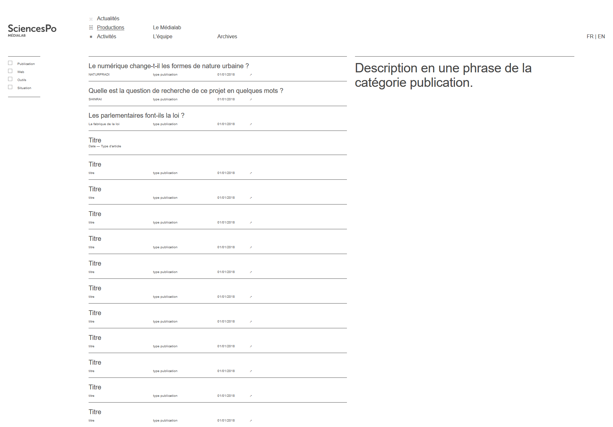

# Agenda

1. Démo
2. Rétrospective
3. Plannification

# Démo

## Les contenus

- 29 pages, 163 news, tous les peoples, productions (438 en tout : 25 tools, contenus Spire)
- y'a tous les champs sauf les nouveaux champs et ce qui diffère

Espérance de mise en prod pour vendredi.

## Benjamin

L'intégration dans le CMS n'a pas encore commencé.
On est en train de faire en sorte que ça s'affiche sur mobile.

On prépare la prochaine étape d'intégration avec React.

.png)

# Rétrospective

## Joies

- c'était cool de passer du temps sur des scripts en JavaScript, pour importer des données
- j'ai bien aimé la reprise à côté de Paul, qui était content, et c'était euphorisant
- les vacances (c'était nécessaire)
- le fait d'avoir fait une coupure me permet d'aborder cette itération avec sérénité

## Merci à...

- merci Guillaume se faire la transformation du HTML
- merci Paul de reprendre la main sur le sujet dès cet après-midi
- merci Julie pour avoir bien bien nettoyé la partie du code HTML qu'on a créé jusqu'ici
- merci aux standups car ils nous ont permis d'avancer en adressant de vrais problèmes
- merci Paul pour l'envoi des données (ça m'a rassuré sur  le fait que ça fonctionne, et de farfouiller dedans)

## Freins et frustrations

- on avait tenté de faire des standup meeting et ça ne marchait pas, donc on a arrêté (d'ailleurs on n'étais pas) -- on rentrait dans les problèmes, du coup ça prenait trop de temps, ça perdait un peu de son sens : maintenant quand il y a des problèmes on en parle, sans forcément réunir tout l emonde, et ça avance bien
- j'ai l'impression qu'on a pataugé sur la catégorisation des productions (4 pas en avant, 4 pas en arrière) ; je pense que c'est à peu près figé maintenant
- j'aurais bien aimé qu'on aie 2-3 trucs d'intégrés pour les ateliers, pour qu'ils voient un truc un peu finalisé mais en fait c'est pas grave ; on leur présentera tel quel
- sur les contenus, y'a les anciens projets qui me prennent pas mal la tête, de comprendre ce qu'il y a, de reclassifier des activités (tout est mis en projet de recherche, or tout ne l'est pas), qu'on le remette dans des petites cases et qu'on voit comment on les présente, il n'y a personne pour m'aider -- j'attends la mise en prod du CMS pour faire ces modificatons
- du côté des images (faire en fonction des projets), ce sont des choses qui ont une matière variable -- c'est pas l'urgence, mais j'aimerais me dire "j'ai toutes les images, et on n'en parle plus" -- entre-deux assez désagréable pour l'instant
- travailler avec du faux texte

> Je préfère qu'on prenne notre temps et qu'on fasse un truc de qualité qui marche bien.

## Questions

- les titres de certaines publications, certains sont très longs (notamment les news) : je me demandais si vous comptiez rationnaliser tout ça
> Je pense qu'on va peut-être un peu les retravailler, les nettoyer. J'ai nettoyé 6 mois, et après j'ai laissé tomber.
> Ce n'est pas à le prendre en compte dans le design. On n'a pas envie que les titres fassent 8 lignes.
- notre TODO est bien chargée, mais vous, vous avez un truc sur lequel on pourrait avancer en priorité et qui vous débloquerait ?
> On n'a pas besoin de changer nos priorités, mais je pense qu'il faudrait d'aborder intégrer dans React
- pour les ateliers d'écriture, est-ce que c'est pertinent d'utiliser le CMS pour cet atelier d'écriture ? (ils ne peuvent pas saisir les photos, )
> Ils saisissent dans le CMS leurs contenus, et ils éprouvent l'interface
> J'ai envie qu'on travaille sur des contenus en prod, travailer sur Git et versionner les contenus
- Quand est-ce qu'on met en prod ?
> Vendredi au plus tard.
> La seule incertitude c'est : est-ce que les CMS versionnera les contenus ou pas ?

## Rendez-vous

- Paul, Benjamin et Julie ; mercredi 16/01 (avancer sur les interfaces), 14h-18h au 13 rue du l'université
- réunion technique mardi matin (le 15/01), pour faire la stratégie de comment on avance suite aux ateliers
- Thomas et Amélie, à partir de 17h30 le jeudi

# Planification

- Focus contribution : passage en prod, commencer à reprendre les contenus, amorcer le travail sur les images
- Focus consultation : faire entrer les gabarits People, Home et Listing Activités de Julie et Benjamin dans React

## Quelle est l'action vitale que tu aimerais mettre en place pendant cette itération ?

- la mise en prod
- publier un contenu de page People ou Objet très précise (un vrai texte, des images, des vidos -- de quoi butter sur les cas particuliers)
- commencer à nettoyer les contenus
- transmettre 2 ratios d'image (petites images, grandes images) sauf les people

## Quelle est l'action vitale dont tu as besoin pour avancer dans ton travail pendant cette itération ?

- créer une Actualité ou une Activité pour le rendre nickel et exhaustif
- la mise en prod est effective
- avoir les images de couverture dans le CMS (les images dans le contenu c'est OK

# Cloture

- c'était OK pour moi ; un poil long (les merci à, les frustrations)
- utile où ça permet de se remettre dans le bain
- RAS
- un peu long mais utile car on peut se caler en fonction des attentes de chacun
