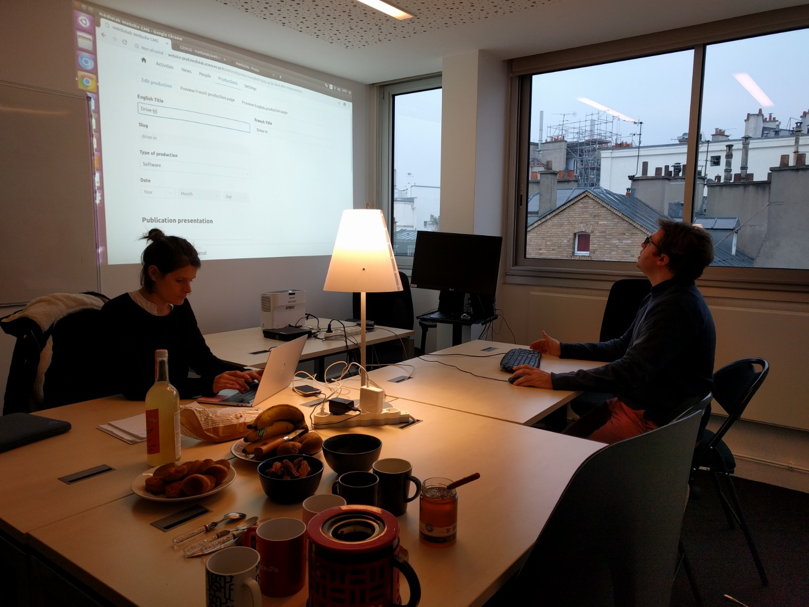
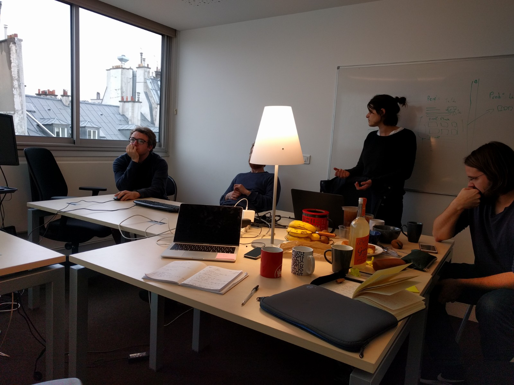
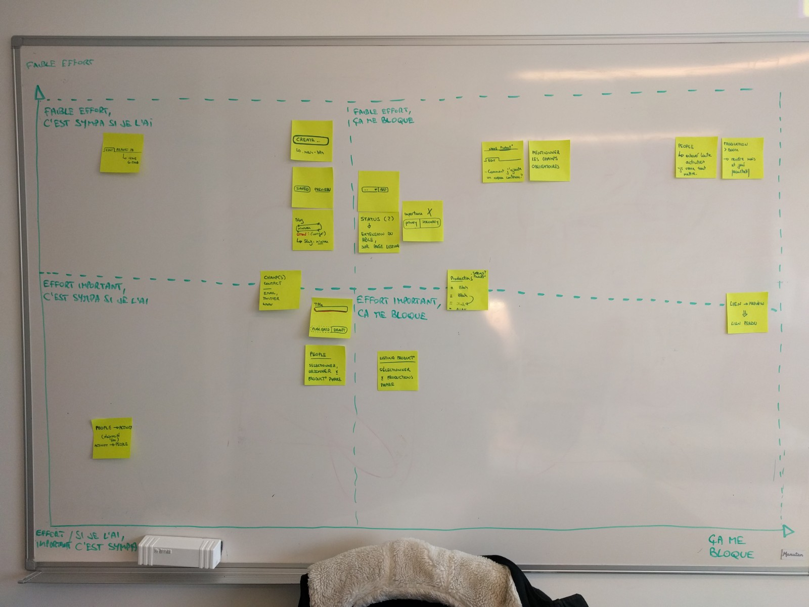

# Préparation

## Attentes

- créer ou mettre à jour des contenus
  - des biographies
  - des activités

L'observation des ateliers servirait à produire des **guides d'écriture**. Ces guides (la forme n'a pas été discutée) ont pour intention d'aider à rédiger les contenus.
Par exemple, lorsqu'on crée un projet (Activity), il faudrait au moins que chaque projet présente : le contexte d'utilisation, la méthodologie, son but, les partenaires et à qui il s'adresse.
Pour des personnes (People), Amélie évoque la formation, le parcours et les activités actuelles.

## Indicateurs de réussite

Cette session sera une réussite si au moins l'un de ces éléments est proche d'être atteint :

- accueillir 5 participant·es
- les tests d'utilisation décèlent des problèmes qui gênent la production de contenus

## Cycle de publication

On affine notre connaissance du cycle de publication

1. Draft
2. Published
3. Preview (sur l'instance du CMS)
4. Deployed (sur l'instance visible par le public du site)

Le contenu du CMS est géré en base de données tandis que la version publiée est construite sous forme de fichiers statiques, envoyés sur l'hébergement qui accueille le public du site.

## Dépôts Git

Le **dépôt GitHub** contient le code source du site. Ce n'est pas clair quelle action faire pour déployer un changement de code en production ou préproduction.

Le **dépôt GitLab** contient les données du CMS. Ce choix s'explique par le souhait préventif de ne pas avoir de données personnelles qui trainent. L'intégration continue de GitLab publie le site en production et préproduction.

# Logistique

Chaque personne invitée peut venir avec son ordinateur, ou utiliser un ordinateur branché à un vidéoprojecteur. Elle reste autant de temps qu'elle le souhaite.

Un tableau expose les problèmes/actions sensibles relevées en cours de route.

Il y a du thé, des biscuits bio et des fruits bio, si possible de saison. Un soin a été porté à disposer une ambiance lumineuse chaleureuse, entre autre pour créer une ambiance différente des réunions, blastées au néon blanc.

# Observations

**Rôle et Statut** : une longue discussion a émergé sur l'intention des champs et leurs valeurs. Il semblerait qu'il y ait une volonté d'harmoniser les intitulés de poste, et de le compléter avec le champ Status. Le Role serait une peut-être à changer pour une liste fermée. Pour faciliter le repérage de "qui fait le même travail que qui ?".

**Thèse** : s'il y a une distinction entre thésard·e et personnel encadrant, ça offrirait la possibilité de démarcher quelqu'un pour devenir son thésard·e. C'est une pratique courante dans le domaine.

**Statut** : ce n'était clair pour personne, sur ce qui était attendu précisément de ce champ. Une information contextuelle supplémentaire ou une reformulation du libellé seront nécessaires pour **clarifier**.

❓ Le **Statut** est censé être personnel ?

😃 Elles sont sympa tes réunions !

## Productions

🗣 Les **Productions** _par le_ Médialab.

> Rendre visible…

❓ Qu'est-ce que je dois faire ?

❓ Une production, c'est un projet ?

❓ Est-ce que je vais retrouver mes outils, ceux qui sont déjà renseignés dans Spire ?

⚠️ La marche à suivre semblerait de 1) d'abord publier sur Spire et 2) ensuite publier sur le site du Médialab. Est-ce que le CMS devrait expliciter ce flux ?

👁 Il semblerait que l'absence de catégorisation des productions dans la liste déroulante pose problème. Entre avoir une liste déroulante par type de production et catégoriser la liste unique, le cœur balance.

---

À propos de la maquette graphique :

> Gardons ce choix radical.

❓ Je me suis demandé ce que donnerait un copié/collé depuis Word.

📅 Une personne a saisi une date de publication dans le futur, à propos d'une Publication. L'attente associée était que ce contenu allait être visible sur le site dès que le contenu serait publié et le site déployé.

> Quand je ne connais pas le titre, je cherche des mots.
> Si c'est une publication, je cherchais bien un nom d'auteur.
> Je cherche différemment en fonction du type.

🤨 Pourquoi est-ce que je découvre http://tools.medialab.sciences-po.fr/website-mockups/ pendant cette session ? Ce n'est pas à jour et pas indiqué.

🗣 Les Activités dans une page People, c'est un **moyen de valoriser l'activité**. C'est important, pour les personnes du Médialab.

# Rétrospective

5 personnes sont venues à l'atelier. Des problèmes ont été détectés. Des validations et clarifications ont émergé. C'est très positif.

😀 Cette session a été vécue comme utile.

😀 Je suis content d'avoir vu Robin alors qu'il n'avait pas prévu d'assister à la session. Son regard est ressenti comme précieux.

😀 C'était chouette d'avoir l'avis et le regard de Dominique Cardon parce qu'il était resté discret jusqu'à présent. C'est vécu comme un **moment phare** de la session.

😀 La session a aidé à répondre à des questionnements jusqu'alors restés en suspens.

😀 La session a permis aux participantes de se familiariser avec l'idée du CMS, et du rendu du site web.

😞 Il n'y a pas eu beaucoup de saisie de contenus réels.

> Je me suis sentie démunie (de ne pas avoir pu clairement montrer où étaient utilisés les champs, la Preview ne les affichaient pas en contexte — Objet, Liste d'Objet, etc.)

😫 J'ai attendu longtemps d'avoir quelque chose de visualisable. J'ai le sentiment d'avancer à l'aveugle. C'est une frustration que je tais — on est mi-janvier et je n'ai accès à l'admin _que maintenant_.

😫 Un effet de bord de la session a révélé la difficulté d'un accès sans contrainte aux maquettes, en dehors des réunions de présentation. Il semblerait que la frustration soit très élevée, que l'attente est celle d'une livraison post-réunion, et que cette attente soit invisibilisée par les pairs.

😡 J'ai eu le sentiment que des réunions se sont organisées pendant la session. J'ai vécu ça comme un accaparement de la parole et un détournement de l'objet de notre travail. C'est très violent pour moi. Je suis sorti plusieurs minutes pendant la session pour reprendre pied à l'intérieur de moi-même.

😡 Je suis passablement agacé par les interruptions de parole qui sont omniprésentes.

😡 Je suis gêné et agacé par les discussions dont le volume sonore m'empêche d'établir un contact de qualité avec les personnes que je questionne.

😡 Je suis en colère contre l'absence d'auto-régulation du temps de parole. Audrey n'a quasiment pas pu toucher au clavier alors qu'elle est restée bien 45 minutes dans la salle. Les discussions solutionnistes prenaient le pas sur l'envie de comprendre.

⚠️ Ces sessions ne sont pas destinées à trouver ou statuer sur une solution mais bien à observer, comprendre et reformuler les ressentis et intentions des participant·es.

🔜 Ce que je changerai : afficher un chrono/horloge sur la table.

🔜 Ce que je changerai : être explicite sur le déroulement du test quand la personne se met au clavier (on t'invite à remplir des contenus, d'abord ta biographie, on observe et on te pose des questions).

🔜 Ce que je changerai : déplacer les discussions "solution" en dehors de la pièce.

🔜 Ce que je changerai : préserver au maximum la posture d'observation, pour éviter la transformation en réunion de travail.

# Suivi des actions

Les post-its du tableau récapitulatif ci-dessus ont été converties en _issues_ et [étiquetées avec `via:workshop`](https://github.com/medialab/website/labels/via%3Aworkshop).

Elles n'ont pas été priorisées, et ne contiennent pas les informations liées à l'effort de développement car c'est une estimation qui ne m'appartient pas.
