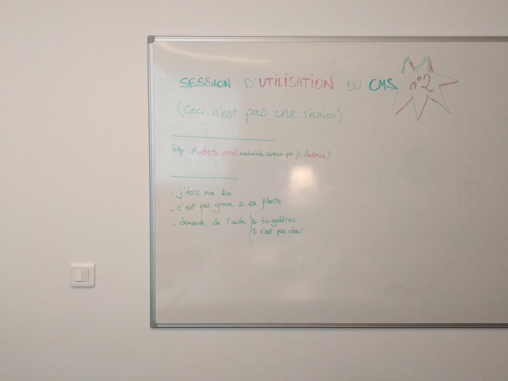
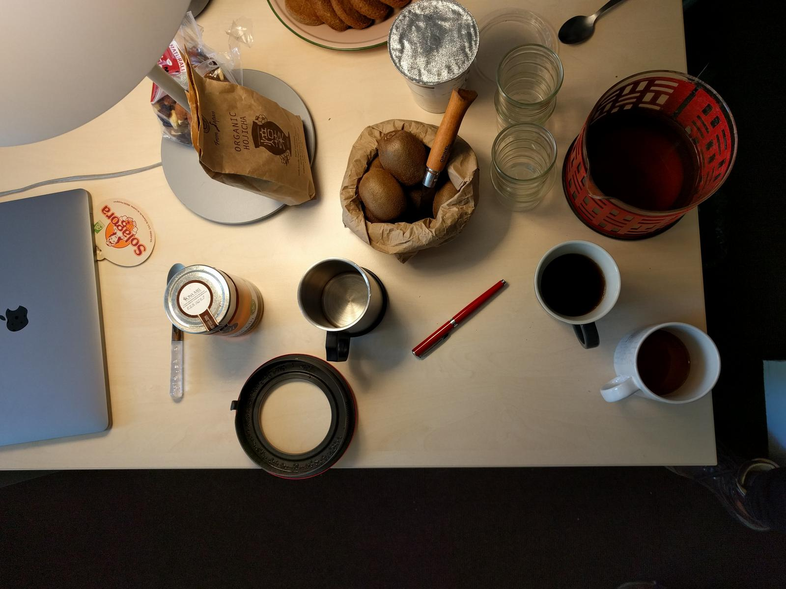
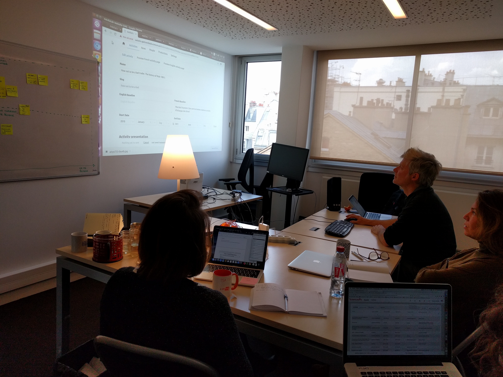
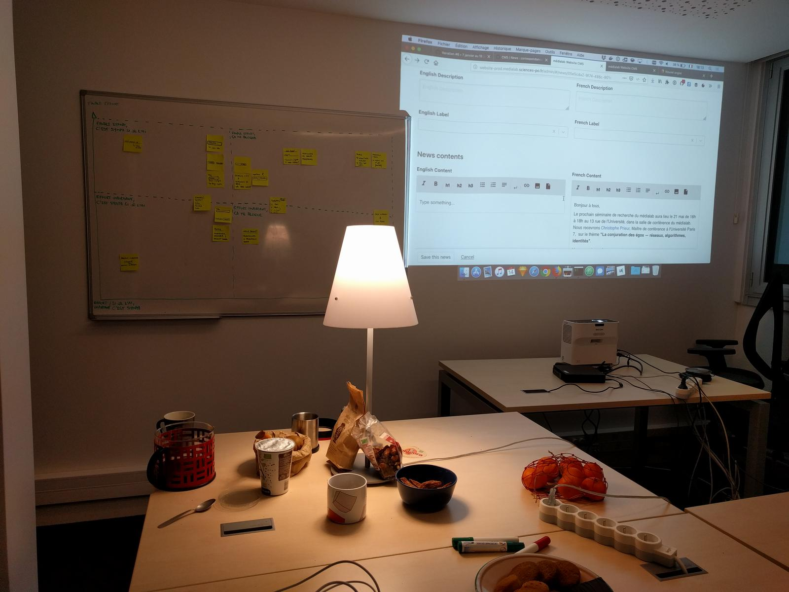

# Préparation

## Attentes

On maintient les attentes, en prenant compte nos ressentis de la session de vendredi pour corriger des choses.

Deux points ressortent :

- notre **posture** : on est avant tout là pour observer, apprendre et comprendre des participant·es — évite l'effet "réunion de travail ad hoc" ;
- **expliciter le cadre** : demander ce que les personnes attendent de leur venue et rester dans ce cadre.

## Logistique

Pareil que dans le [premier atelier d'écriture](../2019-01-11-atelier-ecriture/index.md).

La disposition du goûter a changé (un ilôt dans un coin pour éviter de couper l'espace disponible).

Un tableau blanc contenait quelques instructions et l'URL du CMS.

# Observations

La première personne utilise son ordinateur. Ça ne fonctionne pas, ni dans Chrome ni dans Safari. On découvre par la suite que en HTTP ça roule mais pas en HTTPS ([#160](https://github.com/medialab/website/issues/160)).

🗣 Je viens pour comprendre le CMS, je suis dans l'attente d'une interface simple, pour ne pas avoir à embêter Amélie avec les changements de contenu.

❓ Où est-ce que je clique pour modifier ou créer un projet ?

❓ Les Activities, ce sont les séminaires ?

🤔 Le champ Activity/Baseline, il sert à quoi, je le formule comment ?
(une discussion mène au fait que l'intention est de faire formuler la _question de recherche_)

❓ Les projets passés, ils passent en production ?

🤔 Ah les dates. Ce projet a commencé bien avant 2010.

❓ Comment on fait quand les projets ont été mis en parenthèse pendant un certain temps (et reprennent après la date de fin) ?

😮 Ça m'a surpris de voir "Activity Classification" en bas de l'écran de formulaire ; je m'attendais à le voir en haut, et j'ai l'impression que ça m'aiderait à remplir les champs textuels.

😲 Listing People : Oh, mais XX, il n'est plus du tout au Médialab.

🤔 _Slug_, ça veut dire quoi ? Je ne sais pas si c'est important, on n'a pas la main dessus.

👍 Activity / Lier à une personne : je tap "lep", je trouve mon nom de famille (Lépinay).

🤔 Published / Draft : c'est ambigü, de savoir quelle est la valeur active. Dans le doute, j'ai cru que c'était la première valeur. J'ai moins de confusion sur l'item actif quand il y a 3 choix.

🗣 Quand je lis le CV de Vincent et le mien, on n'a pas l'impression d'être dans la même équipe. Ça m'aiderait d'avoir un guide de référence pour harmoniser notre champ "Content".

❓ Est-ce qu'on peut lier les projets entre eux ? Quand ils sont connexes ?

🗣 Un truc qui m'aiderait, ça serait d'avoir le menu du haut _toujours disponible_, en position fixe, comme le _footer_ de la page.

❓ Comment on revient en arrière dans un champ de texte riche ?

_(longue discussion sur l'import depuis Spire)_

> Le CMS a l'air super simple, convivial. Surtout pour moi qui n'aie pas l'habitude de contribuer des choses en ligne.

🤔 Sur le site, le listing sans les images, ça fait _vintage_, "pas innovant".

🗣 Sur ma page People, je rajoute _tous_ mes projets.

> En fait, ça doit être les plus importants, les projets phares. Ils remonteront en premier, en plus des projets où tu es référencé·e.

➡️ Ça n'apparait que sur ta page à toi.

💡 Il faudrait n'afficher que les projets sur lesquels la personne est liée (pour réduire la liste)

❓ Il y a des trucs qui datent, je vais quand même les avoir dans la liste projet de ma page People ?

❓ Comment je les choisis ces projets ?

🤔 Il veut dire quoi le champ "Situation" ?

❓ Il y a quoi derrière le lien "Archives" (sur le site) ?

❓ Pourquoi avoir un menu "Activity" alors que je veux saisir un projet ?

❓ C'est quoi la différence entre News et Event ?

🤔 Si je mets une date à une news pour le 1er, alors que l'event est le 15, est-ce qu'elle se retrouve noyée dans le fil d'actualités ?

❓ Ah du coup, pour une news de type Event, on peut s'inscrire ? Ça serait plus efficace. Quand je suis dans le métro, je m'inscris quand je suis sur la page, sinon après j'oublie d'y revenir.

❓ Le label d'une news, c'est lié au fait que ça soit un type News ou Event ?

❓ C'est quoi "internal" et "external" ?

❓ Quand je clique sur Publish, le contenu est en ligne ?
> C'est le grand cycle des données.

🗣 J'ai peur de cliquer sur le bouton "Créer" parce que j'ai peur que le contenu soit directement en ligne.

💡 Le champ "Location", il retourne une adresse postale précise ?

> À part la Preview qui est difficile à trouver, c'était facile d'utiliser alors j'avais peur que ça ne soit pas le cas.

# Rétrospective

4 personnes sont venues à l'atelier. Des problèmes ont été détectés. Des validations et clarifications ont émergé. C'est positif.

😊 Je perçois une forte appréciation de pouvoir modifier simplement les contenus, sans modération.

💡 Il y aurait une valeur à présenter le site et les avancées en dehors des ateliers. L'atelier révèle que les personnes en savaient finalement assez peu des avancées.

😊 Je suis content de sentir la satisfaction de l'outil, que les questionnements dans sa construction aboutissent à un outil déjà bien adapté.

😊 Beaucoup des améliorations du CMS touchent à des détails, à l'ordre d'affichage, d'affinage de la présentation.

🤔 L'invitation en format groupe permet de rentrer moins facilement dans le détail, dans le suivi et l'accompagnement que si les rendez-vous étaient individuels. Les discussions permettent de mieux cerner les réflexions des participant·es, de mieux les informer. C'est une autre forme d'(in)formation.

# Suivi des actions

Des _issues_ [étiquetées avec `via:workshop`](https://github.com/medialab/website/labels/via%3Aworkshop) reflètent les points saillants qui ont bloqué l'utilisation ou la compréhension du CMS.

Elles n'ont pas été priorisées, et ne contiennent pas les informations liées à l'effort de développement car c'est une estimation qui ne m'appartient pas.
